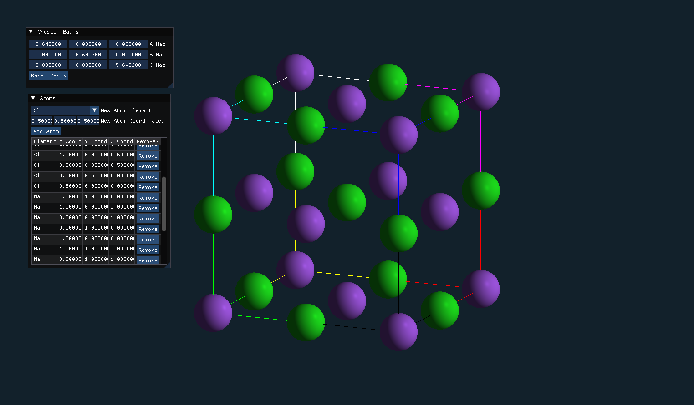

# Crystal Constructor
A desktop application for constructing and visualizing atomic crystal models.

Built using OpenGL and written in C++.



## How to Build
### Clone Repository
Clone this repository to get the Crystal Constructor source files. This project relies on several dependencies that are included as Git submodules. Use the `--recursive` option to get these submodules with the cloned repository.
```bash
git clone --recursive https://github.com/philwilliamson/crystal-constructor.git
```

If you clone without using the `--recursive` option, you can still get the dependencies by navigating into the cloned repository and running:
```bash
git submodule update --init
```

### Build with CMake
Crystal Constructor is setup to be built with CMake. You will need a build system installed that works with CMake, such as GNU Make or Visual Studio, in order to build the project.

Navigate into the cloned repository and generate the build system files with CMake.
```bash
cmake -S . -B ./build
```
This will output the build system files into a newly created `build` directory.

Next, build the Crystal Constructor executable.
```bash
cmake --build ./build
```
Once built, you can run the Crystal Constructor executable. The path to the executable will depend on the build system used.
```bash
./build/executables/crystal_constructor # built with GNU Make
./build/executables/Debug/crystal_constructor.exe # built with Visual Studio
```

> **NOTE:** You will need to run the executable from the main project directory in order for the executable to read the shader sources from the `shaders` directory.

## Dependencies
The following dependenices are included as Git submodules.

Library                                        | Purpose
-----------------------------------------------|-----------------------------
[glfw](https://github.com/glfw/glfw)           | Window and Input Management
[glad](https://github.com/Dav1dde/glad)        | OpenGL Function Loading
[glm](https://github.com/g-truc/glm)           | OpenGL Mathematics
[Dear ImGui](https://github.com/ocornut/imgui) | GUI Management

## Project Structure
```
.
├── CMakeLists.txt
├── CMakePresets.json
├── crystal_constructor // library sources
│   ├── CMakeLists.txt
│   ├── crystal_model   // crystal model state classes
│   ├── external        // third party dependencies
│   ├── opengl_graphics // OpenGL rendering classes
│   ├── user_interface  // gui classes
│   └── utils           // utility functions
├── executables         // executable sources
├── README.md
└── shaders             // shader sources
```

## Additional Information
This project is based on [Glitter](https://github.com/Polytonic/Glitter), an OpenGL boilerplate.